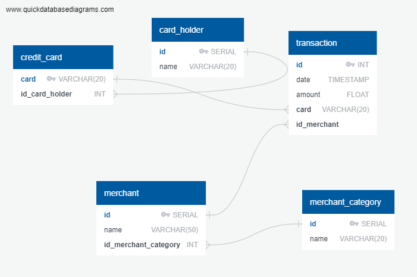
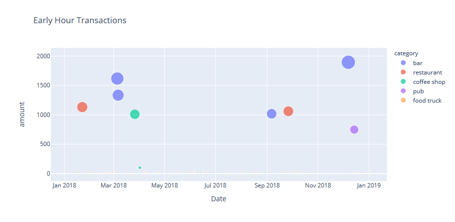
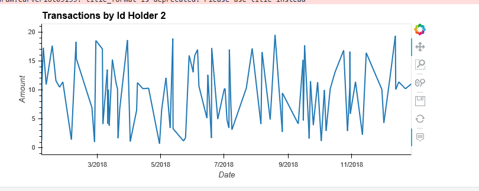
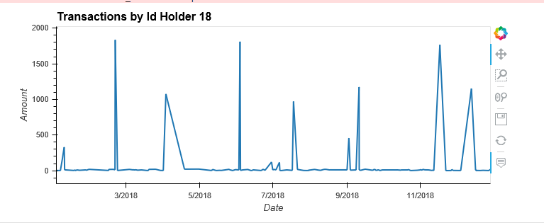
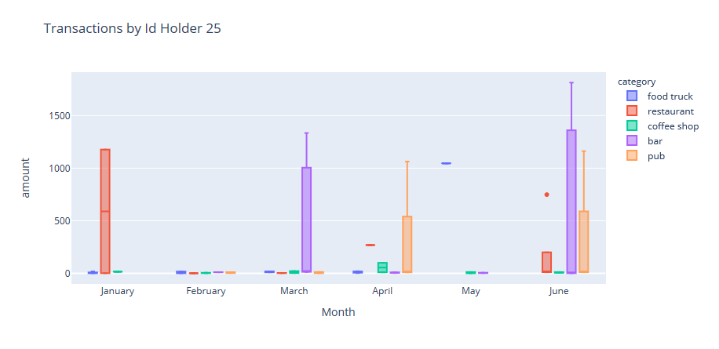
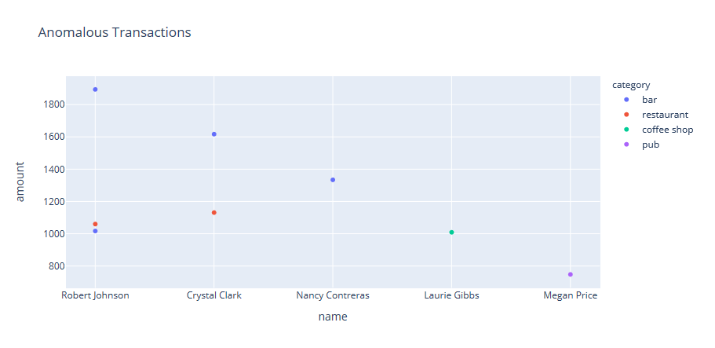

# Fraud_Detection_SQL

*[Credit Card Fraudster by Richard Patterson](https://www.flickr.com/photos/136770128@N07/42252105582/) | [Creative Commons Licensed](https://creativecommons.org/licenses/by/2.0/)*

## Background

Fraud is everywhere these days—whether you are a small taco shop or a large international business. While there are emerging technologies that employ machine learning and artificial intelligence to detect fraud, many instances of fraud detection still require strong data analytics to find abnormal charges.

Application of new SQL skills to analyze historical credit card transactions and consumption patterns in order to identify possible fraudulent transactions.

Accomplish three main tasks:

1. [Data Modeling](#Data-Modeling):
Define a database model to store the credit card transactions data and create a new PostgreSQL database using your model.

2. [Data Engineering](#Data-Engineering): Create a database schema on PostgreSQL and populate your database from the CSV files provided.

3. [Data Analysis](#Data-Analysis): Analyze the data to identify possible fraudulent transactions.

---

## Files

### Query Files

* [schema.sql](SQL/schema.sql)
* [seed.sql](SQL/seed.sql)

### CSV Files

* [card_holder.csv](Data/card_holder.csv)
* [credit_card.csv](Data/credit_card.csv)
* [merchant_category.csv](Data/merchant_category.csv)
* [merchant.csv](Data/merchant.csv)
* [transaction.csv](Data/transaction.csv)

### Data Modeling

Create an entity relationship diagram (ERD) by inspecting the provided CSV files.

**Note:** For the `credit_card` table, the `card` column should be a VARCHAR(20) datatype rather than an INT.

Tool used to develop ERD [Quick Database Diagrams](https://app.quickdatabasediagrams.com/#/) to create your model.

### Data Engineering

Using your database model as a blueprint, create a database schema for each of your tables and relationships. Specify data types, primary keys, foreign keys, and any other constraints you defined.

After creating the database schema, import the data from the corresponding CSV files.

### Data Analysis

Now that your data is prepared within the database, it's finally time to identify fraudulent transactions using SQL and Pandas DataFrames.

Top 100 highest transactions during early hours i.e. 7:00 to 9:00 AM

* Some fraudsters hack a credit card by making several small payments (generally less than $2.00), which are typically ignored by cardholders. Count the transactions that are less than $2.00 per cardholder. Is there any evidence to suggest that a credit card has been hacked? Explain your rationale.

* What are the top five merchants prone to being hacked using small transactions?

* Once you have a query that can be reused, create a view for each of the previous queries.

Created a report for fraudulent transactions of some top customers of the firm using Pandas, Plotly Express, hvPlot, and SQLAlchemy to create the visualizations.

* Fraudulent transactions in the history of two of the most important customers of the firm on the basis of their cardholders' IDs are 18 and 2.

 
 
  
  * Observation : `The consumption pattern for both the id holder is very different. Id Holder 2 makes too many small transactions. Id Holder 18 has transactions ranging till $1839. Id Holder 2 is more suspectable to fraudulent transactions`

* The CEO of the firm's biggest customer suspects that someone has used her corporate credit card without authorization in the first quarter of 2018 to pay for several expensive restaurant bills. You are asked to find any anomalous transactions during that period.

  * Using Plotly Express, created a series of six box plots, one for each month, in order to identify how many outliers there are per month for cardholder ID 25.
  
  

  * Observations : `There seems to be fraudulent transactions pertaining to Restaurant & Food Truck category where Food Truck is ranging from $1.46 to $1046`

## Challenge

Another approach to identify fraudulent transactions is to look for outliers in the data. Standard deviation or quartiles are often used to detect outliers.

#### Identifying Outliers based on Standard Deviation

#### Identifying Outliers based on Interquartile Range

